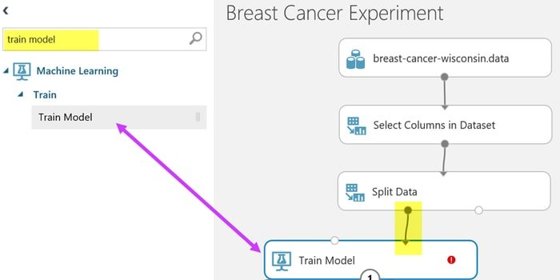

# DataSets
Listed are a few interesting datasets for practicing Applied Machine Learning

## Classification:
Breast Cancer Wisconsin (Diagnostic) Data Set:

Machine learning dataset for classification problem is breast cancer diagnostic dataset. 
It’s a well-known dataset for breast cancer diagnosis system. This breast cancer diagnostic dataset is 
designed based on the digitized image of a fine needle aspirate of a breast mass. 
In this digitized image, the features of the cell nuclei are outlined.

## Features:

1. There are three types of attributes available, i.e., ID, diagnosis, 30 real-valued input features.
2. For each cell nucleus, ten real-valued features are calculated, i.e., radius, texture, perimeter, area, etc.
3. There are two types of predicting filed, i.e., benign and malignant.
4. In this database, there are 569 instances which include 357 benign and 212 malignant.

Click here to [download!](http://mlr.cs.umass.edu/ml/datasets/Breast+Cancer+Wisconsin+%28Diagnostic%29)

breast Cancer Diagnosis : http://mlr.cs.umass.edu/ml/datasets/Breast+Cancer+Wisconsin+%28Diagnostic%29
spam classification or spam detection: Spam SMS Classifier Dataset : https://www.kaggle.com/uciml/sms-spam-collection-dataset
Banknote Authentication Dataset: https://archive.ics.uci.edu/ml/datasets/banknote+authentication#

Text Classification Challenge: BBC News Datasets : http://mlg.ucd.ie/datasets/bbc.html
VIdeo Classification: Youtube Dataset : https://research.google.com/youtube8m/

Regression:
Predicting the quality of Wine: Wine Quality Dataset: https://archive.ics.uci.edu/ml/datasets/Wine+Quality

Clustering:
US Census Data (1990) Data Set : https://www.ubuntupit.com/best-machine-learning-datasets-for-practicing-applied-ml/

Twitter Sentiment Analysis: https://www.kaggle.com/c/twitter-sentiment-analysis2/data
natural language processing : https://snap.stanford.edu/data/web-Amazon.html

Image recognition : MNIST Dataset : http://yann.lecun.com/exdb/mnist/

