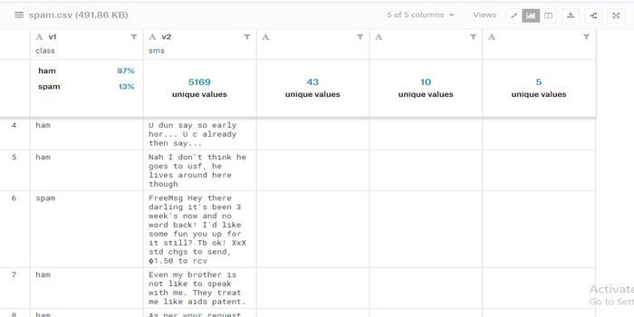
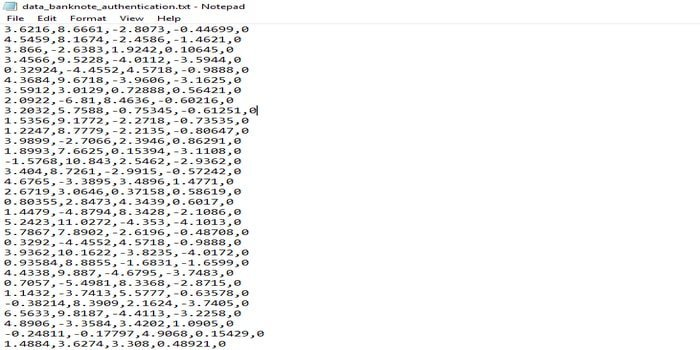
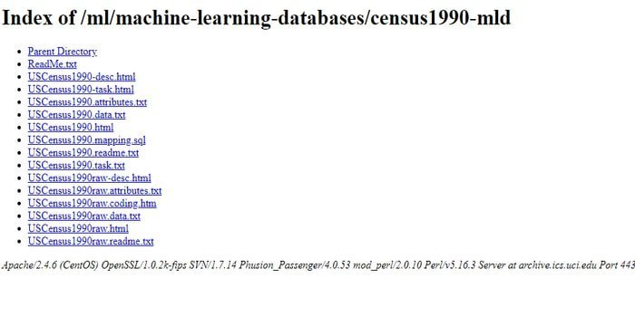
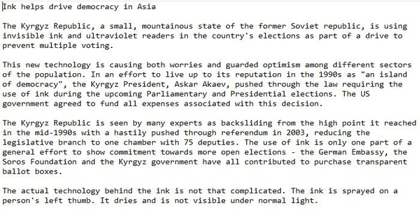
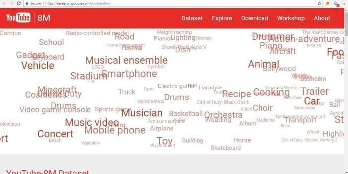
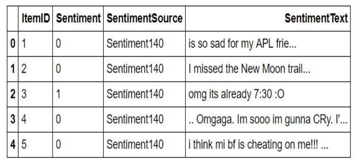
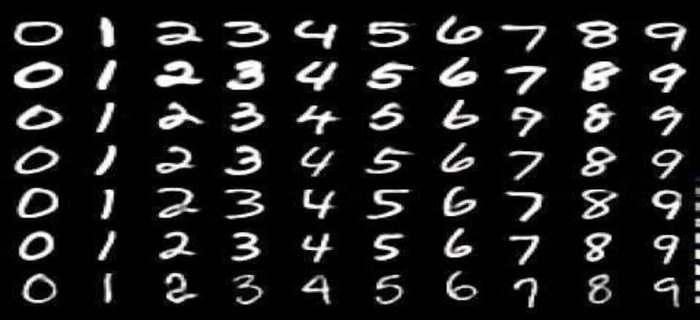

# DataSets
Listed are a few interesting datasets for practicing Applied Machine Learning

# Classification:
## Breast Cancer Wisconsin (Diagnostic) Data Set:

Machine learning dataset for classification problem is breast cancer diagnostic dataset. 
It’s a well-known dataset for breast cancer diagnosis system. This breast cancer diagnostic dataset is 
designed based on the digitized image of a fine needle aspirate of a breast mass. 
In this digitized image, the features of the cell nuclei are outlined.

## Features:

1. There are three types of attributes available, i.e., ID, diagnosis, 30 real-valued input features.
2. For each cell nucleus, ten real-valued features are calculated, i.e., radius, texture, perimeter, area, etc.
3. There are two types of predicting filed, i.e., benign and malignant.
4. In this database, there are 569 instances which include 357 benign and 212 malignant.

## [Download](http://mlr.cs.umass.edu/ml/datasets/Breast+Cancer+Wisconsin+%28Diagnostic%29)

## Spam SMS Classifier Dataset:

Among so many machine learning applications, spam classification or spam detection is interesting one. 
Also, it’s a well-known task for an academic project or machine learning research. However, if you are 
a beginner in this field, you can build or develop a spam classifier using this dataset. 
This SMS Spam dataset may be a set of SMS labeled messages that are collected for SMS Spam analysis.

## Features

1. This dataset contains 5,574 messages, which is written in English.
2. Each line contains one message.
3. Each line has two columns: one column contains the label (ham or spam), and the other one includes the raw text.
4. The file format is CSV.

## [Download](https://www.kaggle.com/uciml/sms-spam-collection-dataset)

## Banknote Authentication Dataset:

Another interesting machine learning dataset is the banknote authentication dataset. This dataset is 
about checking out the genuine and forged banknotes. In this dataset, data were taken from the
images of genuine and forged banknote. Moreover, the images are 400 by 400 pixels. To extract
the features from these images, a Wavelet transform tool was used.

## Features

1. There are five attributes, i.e., the variance of Wavelet Transformed image, skewness of Wavelet Transformed image,
   curtosis of Wavelet Transformed image, the entropy of image, and class.
2. It’s a classification task.
3. The number of instances is 1372.
4. There is no missing value.

## [Download] (https://archive.ics.uci.edu/ml/datasets/banknote+authentication#)

# Regression:

## Wine Quality Dataset:

If you want to develop a simple but quite exciting machine learning project, then you can develop a system
using this wine quality dataset. By using this dataset, you can build a machine which can predict wine quality.
This dataset is formed based on wines physicochemical properties. To build an up to a wine prediction system, 
you must know the classification and regression approach. So, if you are a beginner, this is the best for your practice.

## Features

1. In this dataset, there are two types of variables, i.e., input and output variables. Input variables
   are fixed acidity, volatile acidity, citric acid, residual sugar, and so forth. The output variable is quality.
2. There are 12 attributes, and the attribute characteristics are real.
3. The number of instances is 4898.
4. There are two datasets included. Moreover, these datasets correspond to red and white vinho Verde wine, which comes from the north of Portugal.

## [Download] (https://archive.ics.uci.edu/ml/datasets/Wine+Quality)

# Clustering:

## US Census Data (1990) Data Set:

This standard, USCensus1990raw data set includes a sample of the Public Use Microdata Samples (PUMS)
person records. The raw data set collected from the U.S. Department of Commerce Census Bureau website.
Data extraction system is applied to collect the data. The dataset characteristic is multivariate. 
Also, the attribute characteristic is categorical.

## Features

1. 68 categorical attributes are included.
2. You have to know the clustering algorithms.
3. In this dataset, mapping is done to form new variables from the old variables.
4. The data is available in .txt format.

## [Download] (https://www.ubuntupit.com/best-machine-learning-datasets-for-practicing-applied-ml/)

# Text Classification Challenge:

## BBC News Datasets

One of the most renowned problems of text classification is news classification. So, to develop
your news classifier, you need a standard dataset. This BBC news dataset is just worthy. There
are five predefined classes. In business class, there are 510 documents, in entertainment class,
386 documents, in a politics class, 417 documents, in sport class, 511 documents, and in technology class, 401 documents.

## Features

1. If you want you can download only pre-processed dataset or raw text files of BBC news data according to the system demand.
2. Includes 2225 documents from the BBC official news website.
3. You may use 50% data as a training dataset and rest as test dataset or as your system requirement.
4. To use this dataset, you must have to cite this paper.

## [Download] (http://mlg.ucd.ie/datasets/bbc.html)

# Video Classification 

## Youtube Dataset

Are you an expert in machine learning research area or want to do something with video classification?
Then, this dataset for machine learning project might help you. Also, you might be glad to know that 
Google has shared a labeled dataset with 8M classified YouTube Videos and its’ IDs.

## Features

1. This dataset is a large-scaled label dataset with high-quality machine-generated annotations.
2. Videos are sampled uniformly, and each video is associated with at least one entity from the target vocabulary.
3. To filter the video labels, they use both automated and manual curation strategies.
4. You can download the CSV file of their vocabulary.

## [Download] https://research.google.com/youtube8m/

# Twitter Sentiment Analysis:

## Twitter Sentiment Analysis Dataset

We all know that sentiment analysis is a popular application of natural language processing (NLP).
Are you interested in building a model of sentiment analyzer? Then, this twitter sentiment analysis
dataset is for you — also, its a task of text processing. Moreover, if you are a fresher/beginner in
the machine learning world, then you may use this interesting machine learning dataset. It may help
you to enhance your machine learning skill.

## Features

1. In this dataset, there are three types or tones of data, i.e., neutral, positive, and negative.
2. The file format is CSV.
3. There are train data (train.csv) and test data (test.csv) file in this dataset. You have to build the model
   using the train data. For evaluation, you have to use test data.
4. Two data fields are available, i.e., ItemID (ID of tweet) and SentimentText (text of the tweet).

## [Download] https://www.kaggle.com/c/twitter-sentiment-analysis2/data

# Natural Language Processing 

## Amazon Reviews Dataset

We all know natural language processing is about text data. In the web, there are an enormous unstructured
data is here and there. So, to solve a real-world application, you need ML dataset. Also, this Amazon reviews
dataset is one of them. It contains 35 million reviews from Amazon spanning 18 years (up to March 2013).

## Features

1. It consists of reviews from Amazon.
2. Product and user information, ratings, and review are included.
3. You have to cite this paper: J. McAuley and J. Leskovec. Hidden factors and hidden topics: understanding rating dimensions with review text. RecSys, 2013.
4. In this dataset, duplicate data may be found.

## [Download] https://snap.stanford.edu/data/web-Amazon.html

# Image recognition

## MNIST Dataset

Do you want to work with handwritten digits? Then this MNIST dataset may help you to build your model.
This Machine learning dataset is for image recognition. Its a well known and interesting machine learning
dataset. The surprising fact of this dataset is that it offers both 60000 instances for training and 10000 for testing.

## Features

1. This dataset helps you to understand and learn how to use ML techniques and pattern recognition methods on real-world data.
2. There are four types of files available, i.e., train-images-idx3-ubyte.gz, train-labels-idx1-ubyte.gz, t10k-images-idx3-ubyte.gz, and t10k-labels-idx1-ubyte.gz.
3. The training set and testing set are disjoint from each other.
4. Get binary images of handwritten digits using NIST’s Special Database 3 and Special Database 1.

## [Download] http://yann.lecun.com/exdb/mnist/

